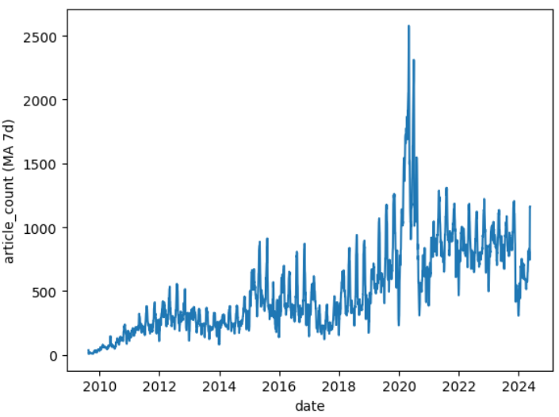
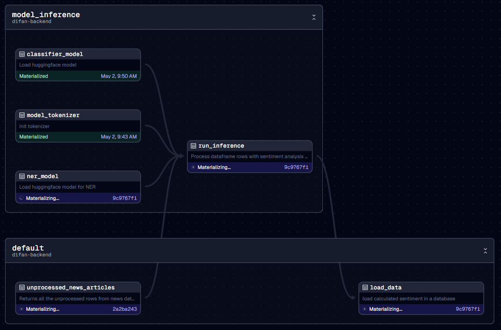

# difan-nlp-open
ODS Natural Language Processing Course, Stream 6.

This repository contains a natural language processing pipeline that analyzes stock news to 
acquire sentiment scores and extract named entities, such as other companies. 

The pipeline is a work in progress at [difan](https://difan.xyz) - a startup aiming to provide the best fundamental 
analysis toolbox for professional investors. Currently, the output data is only available under an academic 
subscription, where we give access to some prototype features and raw data behind them.

# Features
## Sentiment analysis
For sentiment analysis, a finetuned DistillRoBERTa model was used.
Each news article recieves a probability score for 3 classes:
- negative
- neutral
- positive

Resulting ratings can then be used to research the correlation between public sentiment and other, 
perhaps more objective features.

## Named Entity recognition
For NER task of extracting companies mentioned in an article, a [UniversalNER](https://universal-ner.github.io) model was used. 

Each news article is initially associated with only one company, that was in the API query. 
We use Named Entity Recognition along with some fuzzy word matching to retrieve other stock tickers mentioned in the 
article. This allows the user to refine the search topic and simplify the process of analyzing not one stock, 
but a portfolio of stocks, which is a common task for a professional stock analyst or an aspiring finance student.

# Dataset
Our dataset contains around 2.4 million news articles for 17172 stock tickers and is growing at ~900 articles per day. 
Out of all the companies initially loaded we are currently performing inference on only ~1500 companies from major stock 
indices (SP500, NSDQ100, HSI, STOXX600) due to limitations in computational resources.

# Deployment

1. Write correct paths in [dagster.yaml](server/dagster.yaml) volumes section (depending on where you're deploying)
2. Fill in the [config.toml](config.toml) file with MySQL connections and api keys. MySQL server is deployed separately
3. Start Docker engine
4. Execute `docker compose up --build -d`
5. Go to http://127.0.0.1:3000/dagster to open Dagster UI
6. Run pipeline by selecting both `model_inference` and `default` groups and clicking **Materialize selected**:

Alternatively, you can adapt the pipeline [assets](difan-backend/difan_backend/assets.py) script to accept and return 
your own DataFrames without the need to connect to any DBs

---

## Links
1. [difan.xyz](https://difan.xyz) - main website
